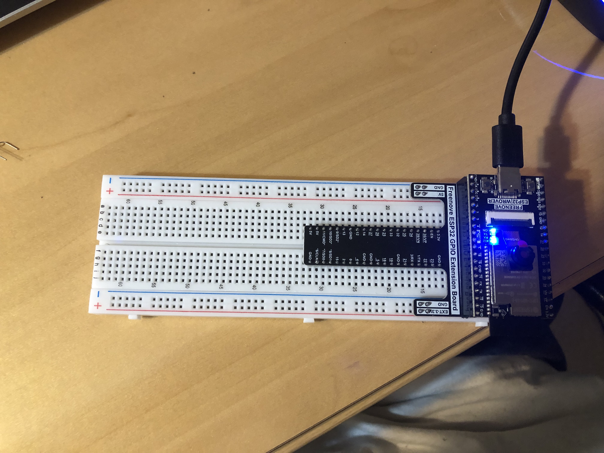
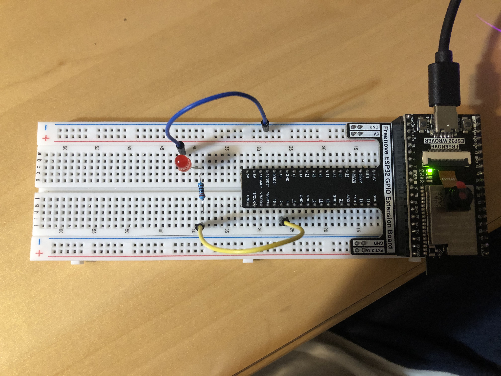
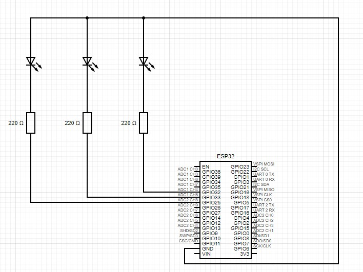
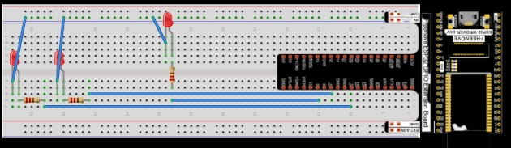
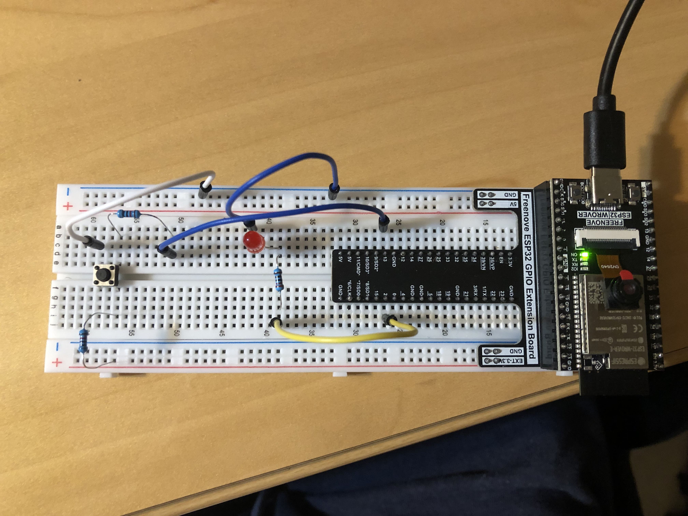
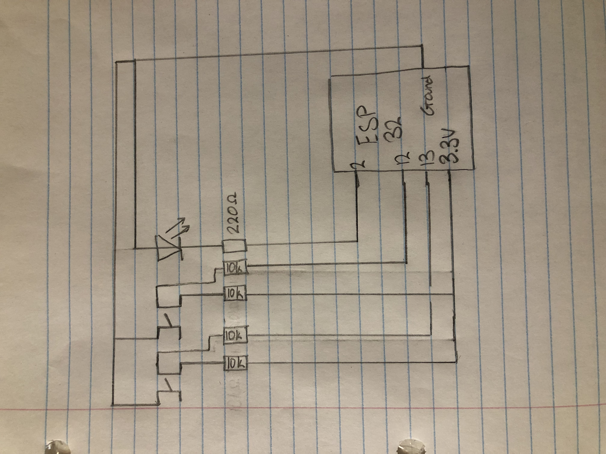
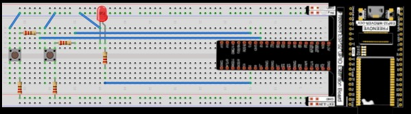
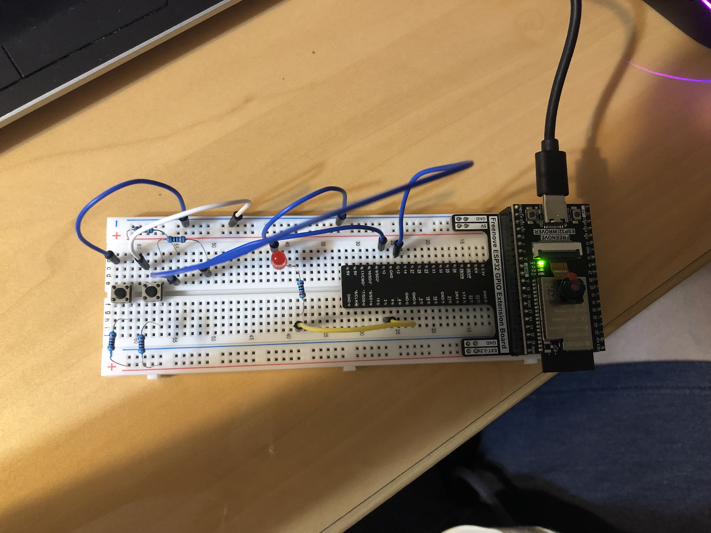

# CMPT-401-Labs

img { border-radius: 10px; } .tab { display: inline-block; margin-left: 40px; } p, h1, h2, h3 { font-family: Arial, Helvetica, sans-serif; } .code { font-family: "Lucida Console", "Courier New", monospace; background-color: black; color: green; }

Lab Assignment #1: LEDs and Push Buttons  
2023-09-19
=====================================================

Project 1.1
-----------

### Breadboard Settings

### Video

Project 1.2
-----------

### Breadboard Settings

### Video

Project #1
----------

### Description of what the lab assignment is about

This lab assignment is about being able to properly use the combination of Thonny, ESP32, and components such as  
LED's to produce lights that will blink in succession

### List of Hardware Compnents

*   3 x LED's (red, green, blue)
*   6 x wires
*   3 x 220-ohm resistor
*   ESP 32

### Circuit Diagram

### Breadboard Diagram

### Breadboard Settings

### Video

### Source Code

from time import sleep\_ms  
from machine import Pin  
  
led1 = Pin(4, Pin.OUT) #create LED object from pin2,Set Pin2 to output  
led2 = Pin(2, Pin.OUT)  
led3 = Pin(5, Pin.OUT)  
try:  
while True:  
#led 1: red  
led1.value(1) #Set led turn on  
sleep\_ms(1000)  
led1.value(0) #Set led turn off  
sleep\_ms(200)  
  
#led 2: green  
led2.value(1) #Set led turn on  
sleep\_ms(1000)  
led2.value(0) #Set led turn off  
sleep\_ms(200)  
  
#led 3: blue  
led3.value(1) #Set led turn on  
sleep\_ms(1000)  
led3.value(0) #Set led turn off  
sleep\_ms(200)  
except:  
pass  

Project 2.1
-----------

### Breadboard Settings

### Video

Project 2.2
-----------

### Breadboard Settings

### Video

Project #2
----------

### Description of what the lab assignment is about

This lab assignment is about being able to properly use the knowledge from the previous lab and combine with the use of push buttons to create a light that will turn on when a button is pressed, but will only turn off if another button is pressed.

### List of Hardware Compnents

*   1 x LED (red)
*   6 x wires
*   1 x 220-ohm resistor
*   4 x 10k-orm resistor
*   2 x push buttons
*   ESP 32

### Circuit Diagram

### Breadboard Diagram

### Breadboard Settings

### Video

### Source Code

import time  
from machine import Pin  
  
led = Pin(2, Pin.OUT)  
button1 = Pin(13, Pin.IN,Pin.PULL\_UP)  
button2 = Pin(12, Pin.IN,Pin.PULL\_UP)  
lastPressed = None  
  
  
def reverseGPIO():  
if led.value():  
led.value(0)  
else:  
led.value(1)  
  
while True:  
if not button1.value():  
time.sleep\_ms(20)  
if not button1.value() and lastPressed != 1:  
lastPressed = 1  
reverseGPIO()  
  
while not button2.value():  
time.sleep\_ms(20)  
  
if not button2.value():  
time.sleep\_ms(20)  
if not button2.value() and lastPressed != 2:  
lastPressed = 2  
reverseGPIO()  
  
while not button1.value():  
time.sleep\_ms(20)
